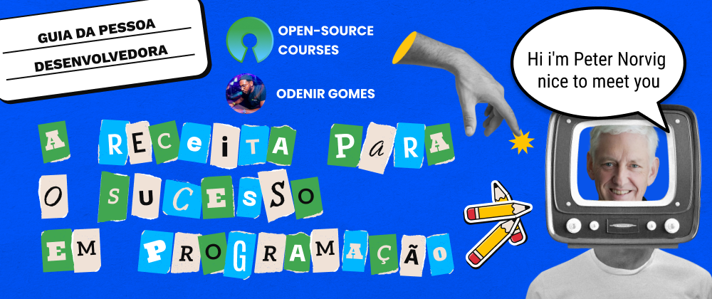

# Bem-vindo(a) ao Guia da pessoa programadora iniciante: A receita para o sucesso em programação

No Guia da Pessoa Programadora Iniciante, vamos abordar **assuntos, reflexões e práticas relevantes na carreira em programação**.

Se você conhece alguém que quer ingressar no mercado de **tecnologia da informação** (TI), compartilhe esse Guia.
Se você é o interessado, então, isso é fantástico, esse material foi feito pra você! Temos o propósito de **facilitar e acelerar seu ingresso no mercado de TI e** **orientá-lo durante sua jornada** para se tornar um **profissional em TI.**

Neste conteúdo específico, 'A receita para o sucesso em programação', vamos abordar os seguintes tópicos:

- Quanto ganha uma pessoa programadora
- O papel de uma pessoa programadora
- Por que todo mundo está com tanta pressa em aprender programação ?
- Receita para o sucesso em programação

## _“Quanto ganha uma pessoa programadora ?”_

> Steve

O Steve é amplamente reconhecido na indústria dos games pelo seu sucesso comercial, sendo o personagem principal do jogo Minecraft, criado pelo desenvolvedor Markus “Notch” Persson e introduzido na sua versão inicial programado em Java. Ele vai representar as suas possíveis dúvidas durante nossa jornada.

De acordo com uma pesquisa no Brasscom de dezembro de 2021, o Brasil tem um grande desafio pela frente.

Com apenas **53 mil pessoas formadas por ano** em cursos de perfil tecnológico e uma **demanda média anual de 159 mil profissionais** de Tecnologia da Informação e Comunicação.

Ainda sobre o estudo da Brasscom, aponta que: Enquanto **a média nacional de salários é de 2.001 reais**, a remuneração média do setor se serviços de **Tecnologia da Informação e Comunicação é de 5.028 reais - 2,5 vezes superior.**

## _“Deu vontade de trabalhar com tecnologia né ?”_

> Odenir Gomes

Por conta da alta média de salários e grande demanda por profissionais qualificados em tecnologia, apontado nesses tipos de pesquisa, como a da Brasscom.

Para quem não sabe, Brasscom é a Associação que reúne as empresas e instituições mais significativas do mercado de tecnologia. E segundo ela, tem o objetivo de intensificar as relações com o mercado para fomentar a transformação digital do País.

Com isso, fica claro saber, por que a Brasscom publica essa pesquisa periodicamente. E isso é ruim ?! Pra mim não, conseguimos mais informações e prever tendências do mercado, atrai mais profissionais e investimentos para nossa área.

Algo importante que preciso dizer pra vocês é:

Sim, a pesquisa aponta que cada vez mais vamos precisar de profissionais qualificados para dar conta da demanda, inclusive há muitos dados e insights na pesquisa da Brasscom, importante conferir a pesquisa completa!

E não, a pesquisa não aponta que vai ser fácil se tornar um profissional qualificado.

Para isso, é necessário de **tempo** e **foco**, vamos falar sobre isso mais a frente.

## _“O que faz uma pessoa programadora ?”_

> Steve

Acredito, que o papel de um programador(a) é **solucionar problemas do dia a dia em prol da sociedade**, utilizando pensamento crítico, raciocínio logico e tecnologia.

Programadores e programadoras trabalham com **Desenvolvimento de Software.** Por isso, somos chamados de desenvolvedores de software, carinhosamente nomeados de “dev”, do inglês _developer._

Em nosso dia-a-dia, utilizamos ferramentas, como:

- Algoritmos
- Linguagens de programação
- Editores de códigos
- Controle de versionamento

Criamos soluções inovadoras, para contribuir em aréas, como:

- Mobilidade com a Uber
- Entretenimento com a Netflix
- Lazer/Moradia com o Airbnb
- Alimentação com o IFood

E ainda vamos além! Contribuimos em aréas, como: Medicina, Engenharia Cívil, Direito e muitas outras.

## _“Preciso de diploma para ser programador(a) ?”_

> Steve

Uma das vantagens do mercado de TI é que para a maioria das vagas, **diploma não um requisito obrigatório**. Daí a relevância desse conteúdo ser o guia para as pessoas programadoras iniciantes se qualificarem e ingressarem no mercado de TI, oferecendo as melhores orientações e não se separando do lado acadêmico.

**Isso não descarta a importância das universidades** em nos ensinar e preparar para trabalharmos em qualquer área da tecnologia. Elas nos introduzem a cada área, sendo que cada uma tem seu próprio universo de possibilidades. Fica claro que para se tornar um profissional em uma área é necessário ir além dos conteúdos introdutórios da universidade, mas a universidade cria uma imersão na tecnologia, trazendo constância nos estudos, orientação e uma comunidade com pessoas de referência para ajudar e ser ajudado.

Mas se você é uma pessoa que não tem essa possibilidade de entrar em uma universidade, **não desanime, porque você pode buscar tudo isso de forma autônoma.** Mais adiante, teremos dicas que poderão te ajudar.

“_O que é Linguagem de programação ?”_

“_O que é Algoritmos ?”_

“_O que é Software ?”_

> Steve

_“Steve, ótimas perguntas, importante nunca ficar com dúvidas!”_

_“Linguagem de programação é a ferramenta que nós programadores utilizamos para dar comandos a um computador”_

“_Mas, vamos com calma, termos, metodologia e ferramentas, aprendemos com o tempo, aplicando em nosso dia a dia”_

“_Vamos por partes, vou responder essas perguntas no próximo conteúdo! Então fica ligado! Agora você precisa se preparar para se tornar um especialista em programação!”_

> Odenir Gomes

## _“Por que todo mundo está com tanta pressa?”_

> Perter Norvig

Peter Norvig é cientista da computação e atual diretor de pesquisas do Google, e tem uma série de livros e artigos publicados. Um deles, intitulado de “Aprenda a programar em 10 anos” _([Teach yourself programming in 10 years](https://norvig.com/21-days.html))._

Nesse artigo “Aprenda a programar em 10 anos“, Norvig apresenta críticas sobre o mito da aprendizagem rápida e fácil em programação. Ele crítica alguns matérias da época, por volta dos anos 2000, livros intitulados de “Aprenda a programar Java em 24h”, “Aprenda a programar Python em 24 horas”… Você acha que consegue aprender uma linguagem de programação em 24 horas ?

Tomem cuidado com esse tipo de promessas! Vocês podem até aprender com os conteúdos, mas Norvig argumentou suas críticas por meio de estudos e pesquisas, principalmente as pesquisas de Anders Ericsson, um professor e psicólogo internacionalmente conhecido por suas pesquisas em expertise. Esses estudos demonstram que, em média, leva cerca de 10 anos para se tornar um especialista em qualquer área da vida.

Ericsson, complementa um estudo de expertise que dizendo que 10 mil horas é uma estimativa do tempo necessário para alcançar a expertise em uma determinada área. Norvig também nos diz que 10 mil horas, são várias anos praticando de forma deliberada de 10 á 20 horas por semana e nos dá outra estimativa: 10 anos

Por que todo mundo está com tanta pressa? É como se tivesse a ilusão de que há um atalho para se tornar um especialista, quando na verdade só há um caminho: muito trabalho duro e prática deliberada

Não é sobre aprender uma linguagem de programação em 24 horas, mas sim sobre nós reconhecermos como programadores hoje e nos tornarmos especialistas em 10 anos.

Só depois de entender isso, vi valor para a receita do sucesso em programação contida no artigo de Norvig.

## "Aprendizado em programação requer tempo e dedicação, não há atalhos"

> Steve

## “Isso Steve! Aqui está minha receita para o sucesso na programação”

> Odenir Gomes

De acordo com pesquisas feitas durante todo desenvolvimento desse conteúdo e também as dicas que eu gostaria de ter recebido durante meu início de carreira em TI, **seguem as instruções da minha receita para o sucesso em programação:**

#### **1. FAÇA DA PROGRAMAÇÃO INTERESSANTE**

Já que seu objetivo é se tornar um especialista em 10 anos, é importante tornar sua jornada em programação mais interessante e divertida possível

Conseguimos relacionar tecnologia com qualquer área da vida e você também poderá relacionar programação com aquilo que você gosta. Então, **pense em um projeto pessoal**, que irá resolver um problema pessoal seu, da sua família e/ou de alguém próximo, anote em algum lugar que tenha acesso futuramente e busque conhecimento para desenvolvê-lo.

Minha dica é: Pense em um projeto pessoal

O projeto pessoal que eu pensei é a criação de conteúdo. Escrever artigos, publicar posts e palestrar, confesso que tem tornado minha jornada muito divertida, tem me levado a interagir com a vários lugares e pessoas que nunca pensei que conheceria

#### **2. PRATIQUE MUITO**

Como brasileiro e amante de futebol, tenho noção que para um jogador se tornar profissional é necessário muitas horas de treino, vitórias e derrotas

E para programação não é diferente. Para se tornar um programador profissional é necessário muitas horas estudando e produzindo código

Minha dica é: Crie um cronograma de estudos

Estabelecer dias da semana e o horário que irá dedicar para se desenvolver como pessoa programadora. Esse compromisso trará consistência para sua jornada, consequentemente acelerando sua carreira

Assim, você vai adicionar programação na sua rotina e consequentemente vai **se tornar um programador(a)**.

#### **3. CONVERSE**

Conversar e ler códigos de outros programadores, essa troca é tão importante quanto ler aquele livro do Uncle Bob ou começar aquele Bootcamp da empresa que você admira

Compartilhe conhecimento! Quando percebi que ensinar reforça o domínio, minha paixão por compartilhar cresceu exponencialmente

Minha dica é: Entre e participe de uma comunidade

Engaje de coração na comunidade, interaja genuinamente e contribua para fortalecer a comunidade que se identificou

Interagir com comunidades e pessoas irá abrir seus horizontes para mais oportunidades.

#### **4. CONSTRUA UMA MENTALIDADE MAMBA OU MENTALIDADE DE CRESCIMENTO**

Segundo Kobe Bryant, ter uma mentalidade Mamba significa “apenas tentar melhorar a cada dia”

Minha dica é: Leia o livro “The Mamba Mentality: How I Play” de Kobe Bryant

Bryant, fala sobre a obsessão por grandeza que tinha, isso o fazia aguentar a grande carga que tinha seus treinos para estar competindo entre os melhores

Também, nos aconselha a aprender com os nossos erros e entender que fazem parte do processo.

## "Obrigado por ter lido até aqui"

> Odenir Gomes

Resumindo, a área de programação está cheia de oportunidades. Mas, para alcançar sua tão sonhada vaga, é necessário **dedicação, foco e muita prática.**

Por isso, tenha um objetivo, quase como uma obsessão. Para se tornar um especialista em TI, faça da programação divertida para se manter motivado.

Em momentos em que faltar motivação, tenha **comprometimento com seu cronograma e plano de estudos;** compartilhe sua jornada com a comunidade, seguindo essas dicas, assim você vai se manter em constante evolução e, consequentemente, vai **acelerar sua qualificação para o mercado**.

No próximo conteúdo, vamos abordar os assuntos relacionados ao desenvolvimento de software, algoritmos, linguagem de programação. Vou passar um plano de estudos para você começar a aprender sua primeira linguagem de programação, então, fique ligado!

Muito obrigado por ter lido até aqui, espero que você gostado do conteúdo!

Seu feedback é muito importante para a evolução do projeto. Então, comente em nossas redes e compartilhe com seus amigos!

Até a próxima…

## Referências

Estudo da Brasscom aponta demanda de 797 mil profissionais de tecnologia até 2025. Disponível em: <[https://brasscom.org.br/estudo-da-brasscom-aponta-demanda-de-797-mil-profissionais-de-tecnologia-ate-2025/](https://brasscom.org.br/estudo-da-brasscom-aponta-demanda-de-797-mil-profissionais-de-tecnologia-ate-2025/)>

SENAC. Aquecido no Brasil, mercado de TI indica aumento de vagas de trabalho. **G1**, 2022. Disponível em: <[https://g1.globo.com/mg/centro-oeste/especial-publicitario/senac/senac-em-divinopolis/noticia/2022/06/15/aquecido-no-brasil-mercado-de-ti-indica-aumento-de-vagas-de-trabalho.ghtml](https://g1.globo.com/mg/centro-oeste/especial-publicitario/senac/senac-em-divinopolis/noticia/2022/06/15/aquecido-no-brasil-mercado-de-ti-indica-aumento-de-vagas-de-trabalho.ghtml)>

Salários de Especialista Em TI em Brasil. **Glassdoor,** novembro de 2022. Disponível em: <[https://www.glassdoor.com.br/Salários/especialista-em-ti-salário-SRCH_KO0,18.htm](https://www.glassdoor.com.br/Sal%C3%A1rios/especialista-em-ti-sal%C3%A1rio-SRCH_KO0,18.htm)>

NORVIG, Peter. Teach Yourself Programming in Ten Years. Disponível em: <[https://norvig.com/21-days.html](https://norvig.com/21-days.html)>

A Mentalidade Mamba - resenha crítica. **12 Minutos.** Disponível em: <[https://12min.com/br/the-mamba-mentality-e1e27012-34c8-40ba-9623-bef50a86eef2-resenha crítica](https://12min.com/br/the-mamba-mentality-e1e27012-34c8-40ba-9623-bef50a86eef2-resenha%20cr%C3%ADtica)>
