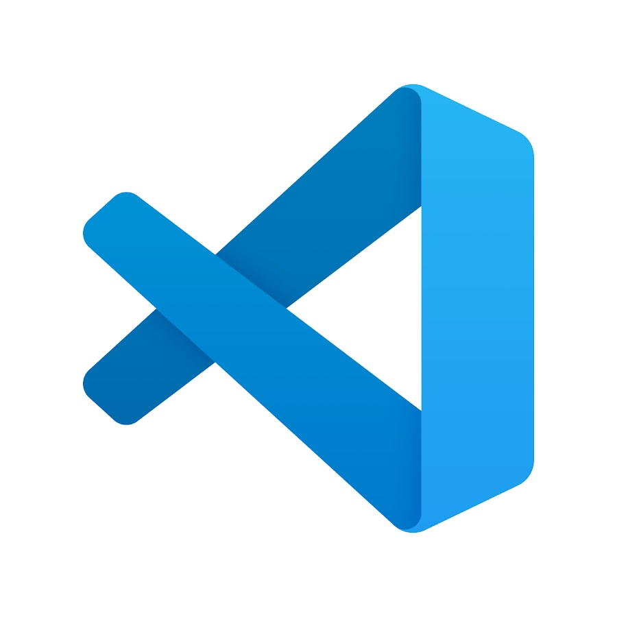

# VSCode , o melhor amigo do Dev

  
  <legend>
    O queridinho dos desenvolvedores
  </legend>

 

VSCode é tipo a Colgate dos editores, nove em cada dez editores recomendam.
Mas porque isso ? É mais leve? É o único gratuito ? É customizável ?

**Sim para todas as perguntas !**

O Visual Studio Code é um editor desenvolvido e distribuído gratuitamente pela Microsoft, completamente customizável, com temas e extensões que facilitam **DEMAIS** a vida do dev, seja você *Junior* ou *Senior*.

As extensões vão desde simples *Snipets* ou auto-completadores, até interpretadores de linguagens ou imagens.

  
  <legend>
    Uma amostra das infinitas extensões que o VSCode possui
  </legend>

***Então além de gratuito é completamente customizável ?***

Sim, você pode alterar a temática do seu editor, deixando a cor em tonalidades de azul, preto, ou a cor que desejar, apenas procurando por temas na loja de extensões.
Mas não só de corzinhas para o editor está populado o vscode, mas organizadores de códigos como os *Brackets Colorizers*, que permitem que você saiba exatamente onde os parenteses estão sendo abertos e fechados, pois cara par possui uma cor diferente.
Ou até mesmo o *Prettier* que identa seu código sempre que você salva o arquivo, e te economiza MUITO tempo.

Olhando dessa forma, deve parecer difícil de usá-lo, pois quanto mais customizável, mais difícil tende a ser algo, certo ?
ERRADÍSSIMO !
O Visual studio code é super simples de se usar, e super intuitivo. Fora isso, se você precisar de algo, com poucas pesquisas você encontra um conteúdo no idioma que você quiser e precisar. 

Por tudo isso eu qualifiquei o VSCode como uma única estrelinha de dificuldade. Você tem tudo o que precisa de fácil acesso, sem precisar de maiores configurações ou tutoriais complexos. 

## Conclusão 

O Visual Studio Code é um editor para todos os desenvolvedores, tanto para os iniciantes que precisam de auxilio de snipets para criar seu código, quanto para os mais seniores, que só precisam se orientar bem no código escrito e testá-lo de diversas formas.