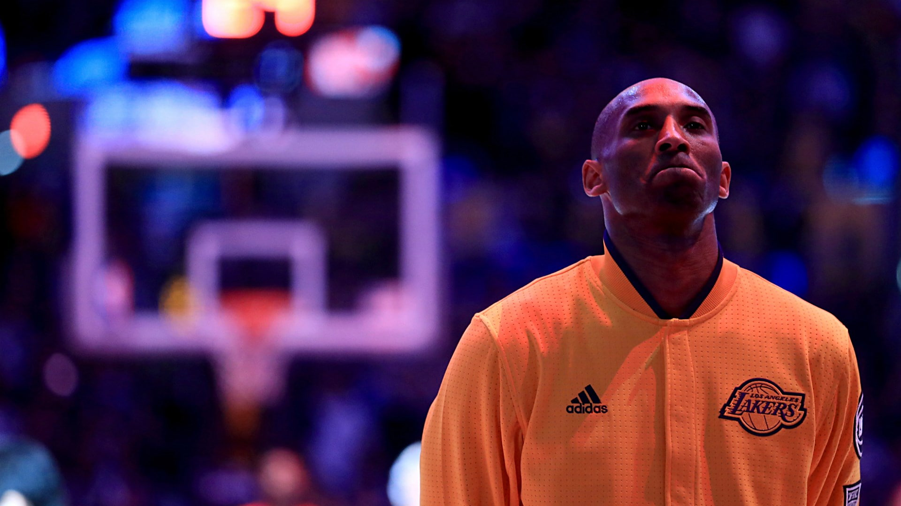
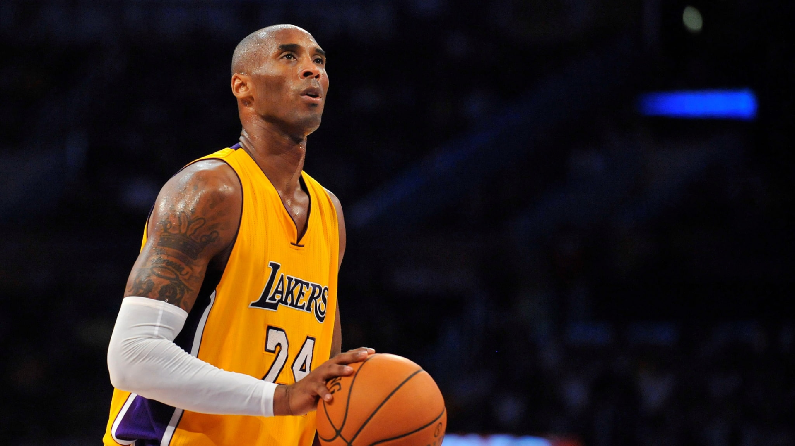
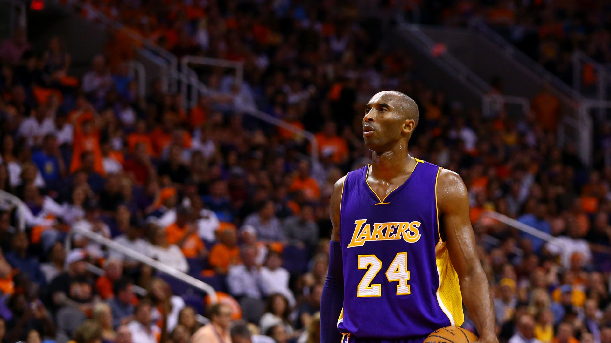
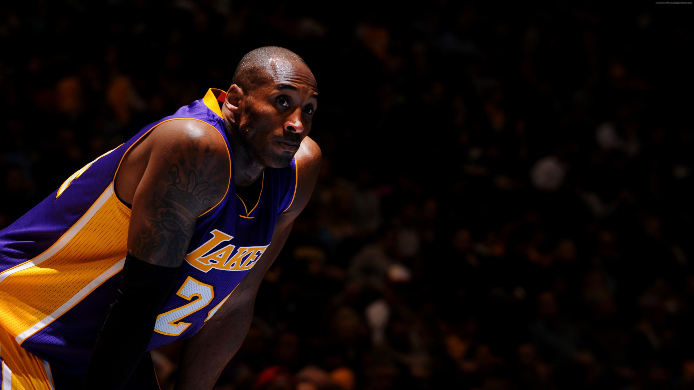
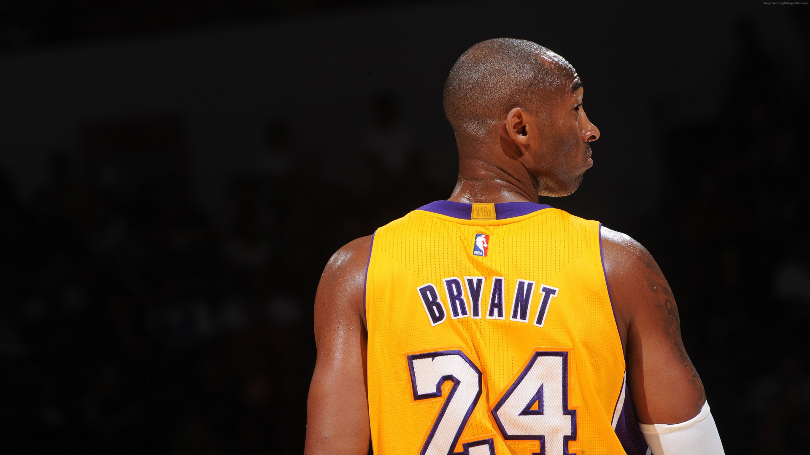

# Como aprender a programar se assemelha a jogar na NBA 🏀

Exploraremos as analogias entre o processo de aprendizado em programação e a prática do basquete. A intenção dessa abordagem é incentivar iniciantes, demonstrando que o processo de aprender programação não é tão diferente de aprender outras habilidades comuns.

Neste artigo, vamos abordar os seguintes tópicos:

- Fundamentos comuns: Exploraremos os conceitos básicos compartilhados entre a programação e o basquete, destacando como ambos exigem uma compreensão sólida dos fundamentos para alcançar o sucesso.

- Trabalho em equipe: Exaltaremos a importância do trabalho em equipe, destacando como essa habilidade é crucial tanto no desenvolvimento de software quanto no jogo de basquete.

- Erros e aprendizado: Examinaremos como os erros são uma parte natural do processo de aprendizado em ambas as atividades, enfatizando que aprender com os erros é uma estratégia valiosa.

- Prática contínua: Analisaremos a importância da prática constante em ambas as atividades, demonstrando como a repetição e a evolução são essenciais.

## Introdução

Kobe Bryant, um dos maiores atletas da NBA de todos os tempos, ao longo de sua carreira com o Los Angeles Lakers, ganhou 5 campeonatos da NBA, 2 medalhas de ouro olímpicas, foi selecionado para 18 All-Star Games e recebeu 4 prêmios All-Star Game MVP, entre outras conquistas. Kobe, que se aposentou em 2016, nos deixou aos 41 anos em 26 de janeiro de 2020, vítima de um acidente de helicóptero em Calabasas, Califórnia.

Mas antes de nos deixar, ele criou um dos maiores legados esportivos e de vida de todos os tempos: a 'Mamba Mentality', segundo sua própria definição, significa "ser a melhor versão de si mesmo". O que é um efeito raro para um atleta conseguir expressar com palavras o que pensa, como se automotiva, como atinge suas metas, e de uma maneira didática o suficiente para nos ajudar a atingir o sucesso, seja no basquete ou na programação.

Ler isso dá a impressão de que Kobe Bryant sempre foi um bom jogador de basquete, mas diferente do que parece, ele até pensou em desistir do basquete e tentar ser jogador de futebol.

Segundo um [artigo](https://www.theplayerstribune.com/br/posts/carta-kobe-bryant-obrigado-michael-jordan) escrito pelo próprio Bryant no site 'Players Tribune', o astro do Los Angeles Lakers quase mudou o foco do basquete para o futebol após uma decepção na infância.

"Zero. Esse é o número de pontos que eu marquei o verão inteiro jogando na Liga do Futuro da Filadélfia. Eu não anotei pontos. Nenhum lance livre, nenhuma bandeja acidental, nenhuma cesta com sorte que foi jogada cegamente ao ar", diz Kobe, no artigo.

O que fez Kobe mudar foi uma frase que seu pai que disse "Você pode fazer zero ponto ou sessenta e eu vou te amar da mesma forma". Segundo o próprio Kobe, ouvir isso o encheu de confiança e fez com que seus sentimentos ficassem mais leves.

Aos poucos, Kobe foi ganhando confiança. Mas percebeu que não possuía as habilidades naturais necessárias e, por isso passou a treinar constantemente nos fundamentos, até que conseguisse executá-los em sua perfeição. A ideia não era fazer algo extraordinário, e sim, apenas o básico bem feito.

Não levou muito tempo para Kobe se tornar o melhor jogador do estado em todas as idades (12 aos 14 anos).

E como isso foi possível? Segundo suas próprias palavras, "É simplesmente matemática. Para ser um bom jogador você precisa treinar de duas a três horas por dia. A maior parte das crianças joga por uma hora e meia em dois dias na semana. Faça a matemática disso, não será suficiente. Então, se você treina obsessivamente todos os dias, durante um ou dois anos, dará um salto".

Isso que o Kobe de 12 anos aplicou para evoluir ele irá chama-lá - 20 anos depois - de "Mamba Mentality".

"Tornou-se uma obsessão. Aprendi tudo sobre o jogo, a história, os jogadores, os fundamentos. Eu não estava apenas determinado a nunca mais ter um verão zero, mas fui levado a infligir aos meus concorrentes a mesma sensação de fracasso que eles, sem saber, me infligiram. Meu instinto matador de marcar nasceu.", diz Kobe, no artigo.

Com a programação, não é diferente. Quanto mais você se dedicar à prática com uma tecnologia, maior será sua habilidade para desenvolver com ela. Não tem segredo, é simplesmente matemática.

Em resumo, a chave para o sucesso na programação é alcançada por meio da prática contínua. Enfrentar desafios e resolver problemas aprofundará sua compreensão, permitindo que você atinja níveis mais avançados.

## Fundamentos comuns

No basquete, é fundamental saber driblar, arremessar, cortar, enterrar e saltar. Não adianta ter uma enorme impulsão e não saber enterrar a bola na cesta.

Os fundamentos são a base crucial para resolução de problemas na área da programação. Eles incluem, por exemplo, a compreensão dos algoritmos, estruturas de dados, lógica de programação e sintaxe das linguagens de programação.

Muitos programadores iniciantes se esquecem dos fundamentos e acabam ficando apegados à sintaxe da linguagem que estão aprendendo. É claro que é importante aprender a sintaxe. Sem ela você não programa. Mas os fundamentos é a base de qualquer linguagem de programação.

Trabalhe forte na construção nos fundamentos, não queira aprender temas mais difíceis de início. Um bom programador é quem faz o simples bem feito. Aprenda os fundamentos básicos. Não transforme seu estudo num monstro.

Ao dominar os fundamentos da programação, você estará pronto para aprender e trabalhar com diferentes linguagens de programação. Embora cada linguagem possua sua própria sintaxe, os conceitos fundamentais permanecem os mesmos.

Em resumo, os fundamentos da programação são importantes porque fornecem a base para uma carreira bem-sucedida. Eles capacitam os programadores a escrever código de qualidade, resolver problemas complexos e se adaptar às mudanças constantes do mercado de tecnologia.

## Trabalho em equipe

Kobe não foi campeão sozinho. Ele tinha ao seu lado jogadores tão talentosos quanto ele, e isso fez toda a diferença na hora de colher os frutos do sucesso.

Na programação não é diferente, o trabalho em equipe é fundamental para alcançar o sucesso em projetos de software. Pois cada profissional tem suas habilidades e competências, e quando esses conhecimentos se juntam é onde o grupo fica mais forte, seja para resolver um problema ou para criar uma solução.

Um exemplo disso é o conceito de pair programming (programação em par), onde dois programadores trabalham juntos no mesmo código, um escrevendo e o outro revisando. Essa prática é útil para identificar erros e melhorar a qualidade do código.

Em uma [pesquisa realizada pelo IEEE](https://ieeexplore.ieee.org/document/854064) (Instituto de Engenheiros Eletricistas e Eletrônicos), "96% dos programadores em dupla relataram que gostaram mais de trabalhar em um ambiente de pair programming do que de trabalhar sozinhos. Além disso, 95% disseram que estavam mais confiantes em seu trabalho quando programavam em pares.".

Por mais que trabalhar sozinho pareça ser melhor em alguns aspectos, é crucial reconhecer os benefícios de colaboração de outros programadores. A colaboração não só traz perspectivas diferentes, como também resolver bugs de um jeito mais rápido. Além disso, ao programar junto com outros, a resolução de problemas técnicos muitas vezes se torna mais rápida e eficaz.

## Erros e aprendizado

Kobe falava sobre a importância dos erros. Ele dizia que aprendeu a encarar o erro como uma parte normal do jogo. Quando cometia erros graves em momentos importantes, em vez de ficar remoendo a frustração ou vergonha, seguia adiante no jogo concentrado nos próximos passos.

Em uma entrevista, ao ser questionado sobre a sensação de perder, Kobe respondeu: 'É emocionante. Isso significa que você tem diferentes maneiras de melhorar.'.

Qualquer coisa que ele pudesse aprender para se tornar melhor, ele fazia. E ao descobrir uma fraqueza, dedicava horas e horas para aperfeiçoá-la.

Perceba que não se trata de enxergar as falhas como algo agradável, mas sim de ter um grande desejo de acertar, sendo os erros bons indicativos de que ainda há o que ser aperfeiçoado.

Isso era parte do que o tornava tão especial.

Na programação, todos passam por erros, seja ao aprender a programar ou já no mercado de tecnologia. Aprender a lidar com erros é crucial para a resolução de problemas. Tudo é uma tentativa e erro, e todos estão aprendendo com os erros, assim como você. O importante é aceitar desafios e nunca parar de aprender. É tudo um processo.

## Prática contínua

"Grandes coisas vêm do trabalho duro e perseverança, sem desculpas." - Kobe Bryant

Quando jovem, Kobe assistiu "Rudy", um filme baseado na história real de um jogador rugby que fez história por meio de sua dedicação ao treinamento contínuo. Esse filme o impactou e o transformou.

O filme lhe fez refletir "Se eu treinar tanto quanto Rudy, como será minha carreira?". Kobe começou a treinar todos os dias para que, quando se aposentasse, tivesse orgulho da sua trajetória.

Perceba que esse mesmo raciocínio de treinamento contínuo diário, em uma escala maior do que a de seus concorrentes, surgiu na vida do atleta aos 12 anos e o acompanhou durante toda a sua trajetória, transformando sua mentalidade, a qual ele passou a chamar de 'Mamba Mentality'.

A prática contínua é um diferencial significativo na programação, pois solidifica a compreensão dos fundamentos. Ela não apenas aprimora habilidades técnicas, mantendo-se atualizado com as novidades, mas também desenvolve uma abordagem lógica para resolver problemas. Além disso, praticar é um investimento profissional, pois o mercado de trabalho está em constante evolução. Em resumo, a prática contínua na programação é essencial para se destacar e alcançar o sucesso.

## Conclusão

Da mesma forma que os jogadores de basquete adotam o Mamba Mentality para se destacarem na NBA, aqueles que estão embarcando na jornada da programação podem encontrar inspiração. Assim como Kobe Bryant sempre buscava aprimorar suas habilidades e se destacar, os aspirantes a programadores podem adotar essa mentalidade de busca constante por conhecimento, prática e resiliência diante dos desafios. Ao incorporar a Mamba Mentality, os iniciantes na programação não apenas refinam suas habilidades técnicas, mas também constroem uma base sólida para uma carreira bem-sucedida no universo da programação. O segredo reside na prática contínua, colaboração em equipe, domínio dos fundamentos e aprendizado com os próprios erros. Esses são elementos que tornam a jornada de aprendizado em programação semelhante à trajetória de um atleta na NBA.

## Exercício

Para solidificar o que você aprender: Crie um pequeno projeto de programação e convide um colega para colaborar. Para isso, você pode utilizar ferramentas de controle de versão, como o Git, para gerenciar as alterações. Nesta aplicação você deve escrever algoritmos simples, como ordenar uma lista de números. Além disso, experimente criar uma estrutura de dados, como uma fila, para entender como esses fundamentos são aplicados na prática.

Vou deixar como recomendação este [repositório da Loiane Groner](https://github.com/loiane/estrutura-dados-algoritmos-java), que contém exercícios de vetores (arrays), pilhas (stacks), filas (queues) e listas (linked list).

## Referências

- Air: A história por trás do logo. - **[Filme.](https://www.youtube.com/watch?v=hIji88b4tIU)**
- Arremesso final. - **[Série.](https://www.netflix.com/br/title/80203144)**
- The Playbook - Estratégias para vencer. - **[Série.](https://www.netflix.com/br/title/81025735)**
- Nunca deixe de tentar. - **[Livro.](https://www.amazon.com.br/Nunca-deixe-tentar-Michael-Jordan/dp/8575424610)**
- Kobe Bryant. - **[Artigo.](https://pt.wikipedia.org/wiki/Kobe_Bryant)**
- Graças a Michael Jordan. - **[Artigo.](https://www.theplayerstribune.com/br/posts/carta-kobe-bryant-obrigado-michael-jordan)**
- A filosofia de vida definitiva de Kobe Bryant. - **[Artigo.](https://rhiraj.medium.com/kobe-bryants-ultimate-philosophy-of-life-how-to-be-the-best-at-anything-73cbbfa5435c)**
