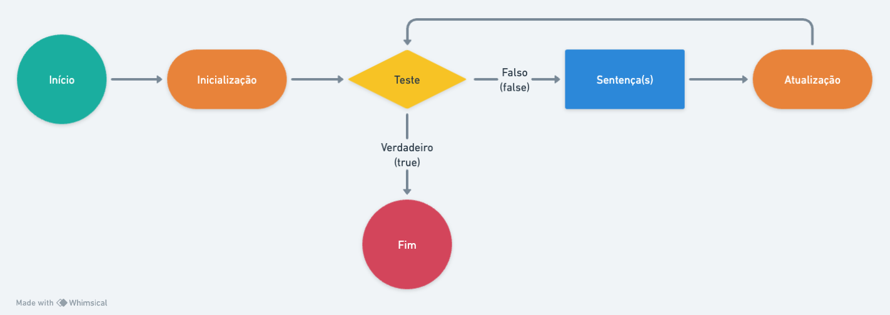

# Faça... Até (For)

O **For** tem um funcionamento específico ele executa um bloco de sentenças por um número específico de vezes.

<p align="center">
  
</p>

Podemos notar na imagem a como funciona o fluxo. No momento de inicialização, é atribuido um valor inicial a uma variável contadora. O _teste_ verifica a condição **antes** de decidir se executará o bloco de sentenças. Caso seja falsa, interrompe as repetições. Se for verdadeira, executa o bloco de sentenças e atualiza a variável contadora para o próximo valor.

A diferença entre o for e o while é que o for foca em repetir um número específico de vezes.

Vamos praticar com exemplo simples! Este exemplo será feito em Javascript, mas você pode tentar implementar na sua linguagem favorita!

## Exemplo

Neste exemplo iremos fazer um contador de 1 até 10.

```js
// Código feito em Javascript
for(let numero = 1; numero <= 10; numero++) {
  console.log(numero)
}
```

Declaramos uma variável **numero** que servirá como contador para o for. Ela armazenará a contagem de repetições.

O for executa o bloco de sentenças contendo o comando `console.log` várias vezes,  variando o valor da variável `numero` de 1 até 10.

Resultado: 1 2 3 4 5 6 7 8 9 10